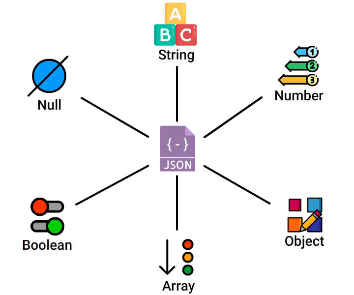

# JSON

**JavaScript Object Notation**

- a data interchange format
- subset of JavaScript Programming Language (Standard ECMA-262 3rd Edition - December 1999)
- represents data in key-value pairs
- hierarchical
- lightweight
- easy to read and write
- machines can parse and generate
- independent of a programming language
- integrates easily with most languages
- commonly used for APIs and Configs
- used to transfers data between a server and various web applications
- `JSON-RPC` is a Remote Procedure call (RPC) protocol built on JSON, which allows system to send multiple notifications to the server.

Examples: all of the following form valid content of a JSON file

```json
{}
```

```json
[]
```

```json
"hello"
```

```json
true
```

```json
123
```

```json
[1, 2, 3]
```

```json
{
    'key1': 'value1',
    'key2': 'value2'
}
```

values can be of any data type; keys must be quoted

```json
{
    'name' : 'Abhigyan Prakash',
    'empId': 1987698,
    'isAllocated': true,
    'techSkills': ['JAVA', 'Python', 'C++'],
    'colleagues': [
        {
            'name' : 'Md. Asif',
            'empId': 1987434,
            'isAllocated': true,
            'techSkills': ['JavaScript', 'Python'],
            'colleagues': [ ... ]
        },
		{
            'name' : 'Subhadip Baisya',
            'empId': 1127467,
            'isAllocated': true,
            'techSkills': ['Oracle DB', 'Bash', 'Linux'],
            'colleagues': [ ... ]
        }
    ]
}
```

```json
[
    {
        'name' : 'Abhigyan Prakash',
        'empId': 1987698,
        'isAllocated': true,
        'techSkills': ['JAVA', 'Python', 'C++'],
    },
    {
        'name' : 'Md. Asif',
        'empId': 1987434,
        'isAllocated': true,
        'techSkills': ['JavaScript', 'Python'],
        'colleagues': [ ... ]
    },
    {
        'name' : 'Subhadip Baisya',
        'empId': 1127467,
        'isAllocated': true,
        'techSkills': ['Oracle DB', 'Bash', 'Linux'],
        'colleagues': [ ... ]
    }
]
```


### JSON Data Types



Data types available

- String
- Number
- Object
- Array
- Boolean
- Null

Data types not available

- function
- date
- Undefined

### Two Important Constructs

JSON is built on two important structures:

- **Object** - A collection of name/value pairs.
- **Array** - An ordered list of values. An array could be a combination of multiple objects.

### JSON vs JavaScript Object

| JSON                                                         | JavaScript Object                               |
| ------------------------------------------------------------ | ----------------------------------------------- |
| It is platform independent                                   | Can only be used within JS                      |
| Keys must be quoted (single or double)                       | Keys need not have quotes                       |
| Keys can only contain `number`,  `string`, `array`  `object`, `null` and `boolean` | Keys can additionally contain `function`        |
| Need to parse JSON object before use                         | Is used directly                                |
| Any valid JSON is a valid JavaScript Object                  | Not all valid JavaScript Objects are valid JSON |

### JSON over XML

JSON is preferred because of the following two important reasons:

- JSON transfers data faster than XML because XML uses tags to describe data which increases their data size.
- JSON uses typed Objects, which can be parsed by any standard JavaScript function. Whereas, XML uses type-less strings, which must be parsed by XML parser (XPath) during run-time, which makes it more complex.

### JSON Limitations

- JSON cannot handle large data. (Need to leverage other formats, which you will learn later in this course.)
- Not suitable for handling different multimedia formats.
- JSON does not have a feature to support 'comments'.

### JSON MIME Type

**`application/json`**