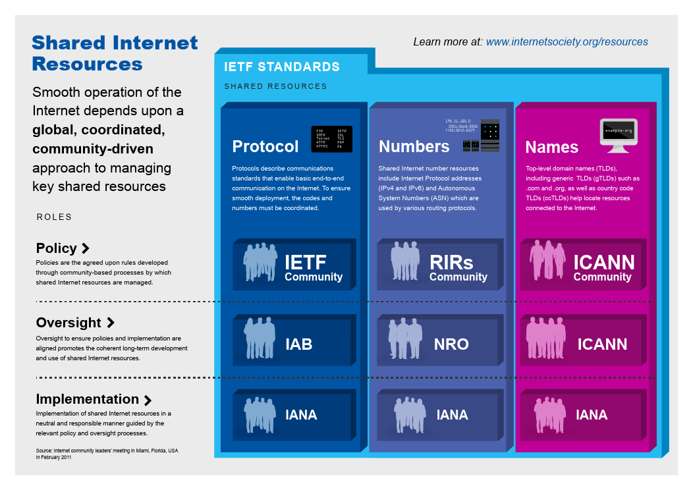

# Network Standards and Organizations

1. [**Internet Engineering Task Force (IETF)**](https://www.ietf.org/)

   The Internet Engineering Task Force is a large open international community of network designers, operators, vendors, and researchers concerned with the evolution of the Internet architecture and the smooth operation of the Internet.

   It is open to any interested individual. 

   The mission  of the IETF is to *make the Internet work better by producing high  quality, relevant technical documents that influence the way  people design, use, and manage the Internet.* This includes  defining the technical foundations for protocols, number  resources, and domain names.

   - [IETF RFCS](https://www.ietf.org/standards/rfcs/)

   - [IETF Drafts](https://www.ietf.org/standards/ids/)

2. [**Internet Society (ISOC)**](https://www.internetsociety.org/)

   The Internet Society supports and promotes the development of the Internet as a global technical infrastructure, a resource to enrich people’s lives, and a force for good in society.

   > The internet is for everyone.

   Our work aligns with our goals for the Internet to be open, globally connected, secure, and trustworthy. We seek collaboration with all who share these goals.

   Together, we focus on:

   - Building and supporting the communities that make the Internet work;
   - Advancing the development and application of Internet infrastructure, technologies, and open standards; and
   - Advocating for policy that is consistent with our view of the Internet

3. [**Regional Internet Registries (RERs)**](https://en.wikipedia.org/wiki/Regional_Internet_registry)

   Regional Internet Registries (RIRs) RIRs oversee the allocation  and registration of Internet number resources within a particular  region of the world. Each RIR consists of the Internet community  in its region and a member of the Number Resource Organization  (NRO). RIRs include AfriNIC in Africa (http://www.afrinic.net), the Asia Pacific Network Information Center (APNIC) (http://www.apnic.net), the American Registry for Internet  Numbers (ARIN) (http://www.arin.net), the Latin American and  Caribbean Internet Addresses Registry (LACNIC)  (http://www.lacnic.net) and the RIPE Network Coordination Centre  (http://www.ripe.net).

4. [**Internet Assigned Numbers Authority (IANA)**](https://www.iana.org/)

   The Internet Assigned Numbers Authority (IANA) is responsible for the global coordination of the Domain Name System (DNS) Root, Internet Protocol (IP) addressing, and other Internet protocol resources.

5. [**Internet Architecture Board (IAB) **](https://www.iab.org/)

   Internet Architecture Board (IAB) The IAB is chartered as a  committee of the Internet Engineering Task Force (IETF) and as  an advisory body of the Internet Society (ISOC). Its responsibilities include architectural oversight of IETF activities, Internet  Standards Process oversight and appeal, and the appointment of  the RFC Editor. The IAB is also responsible for the management  of the IETF protocol parameter registries

6. [**The Number Resource Organization (NRO) **](https://www.nro.net/)

   The Number Resource Organization (NRO) is a coordinating body  for the five Regional Internet Registries (RIRs) that manage the  distribution of Internet number resources including IP addresses  and Autonomous System Numbers. The NRO exists to protect  unallocated Number Resource pool, to promote and protect the  bottom-up policy development process, and to act as focal point  for community input into the RIR system.

7. **Other parties with shared Internet resource roles**

   [VeriSign](https://www.verisign.com/) manages the authoritative DNS root zone file under a cooperative agreement with the United States Government. Responsibility for the IANA functions are assigned through a contract with the  United States Government.

8. [**World Wide Web Consortium (W3C)**](https://www.w3.org/)

   The World Wide Web Consortium (W3C) is an international community where [Member organizations](https://www.w3.org/Consortium/Member/List), a full-time [staff](https://www.w3.org/People/), and the public work together to develop [Web standards](https://www.w3.org/standards/). Led by Web inventor and Director [Tim Berners-Lee](https://www.w3.org/People/Berners-Lee/) and CEO [Jeffrey Jaffe](https://www.w3.org/People/Jeff/), W3C's mission is to lead the Web to its full potential.

   > [principles](https://www.w3.org/Consortium/mission#principles) - Web for all, Web on everything
   >
   > [vision](https://www.w3.org/Consortium/mission#vision) - Web of consumers and authors, data and services, trust

9. [**American National Standards Institute (ANSI)**](https://www.ansi.org/about/introduction)

   The American National Standards Institute (ANSI) is a private, non-profit organization that administers and coordinates the U.S. voluntary standards and conformity assessment system. **Founded in 1918**, the Institute works in close collaboration with stakeholders from industry and government to identify and develop standards- and conformance-based solutions to national and global priorities.

10. [**International Organization for Standardization (ISO)**](https://www.iso.org/)

    ISO is an independent, non-governmental international organization with a membership of 167 [national standards bodies](https://www.iso.org/members.html).

    Through its members, it brings together experts to share knowledge and develop voluntary, consensus-based, market relevant International Standards that support innovation and provide solutions to global challenges.

How is WWW different from the internet?

WWW and internet are not equivalent. Whereas, the internet is the internetwork of numerous networks across the globe, WWW is that part of the internet makes use of the http and html.